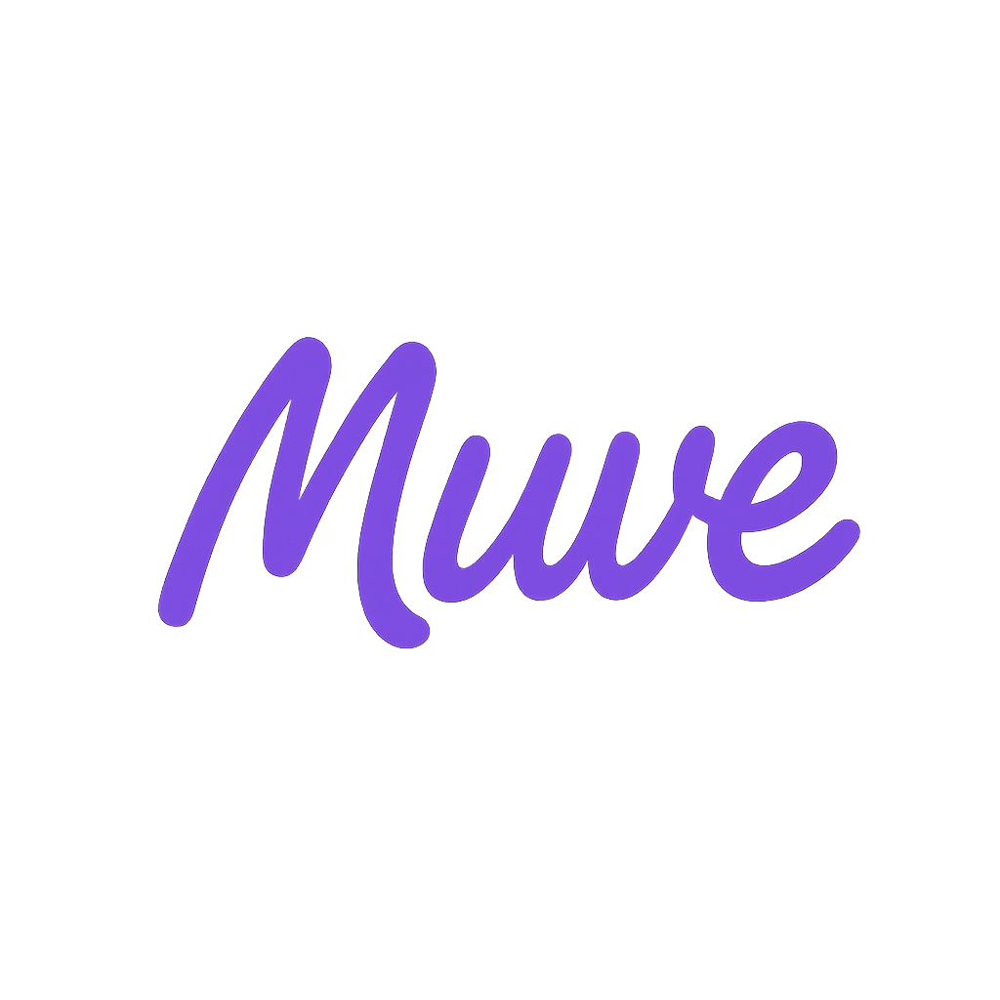

# 🎵 Muve App

Bem-vindo ao **Muve App**, um aplicativo desenvolvido em Flutter com foco em facilitar a conexão entre **músicos locais** e **contratantes** de eventos. O projeto oferece uma interface moderna e fluída, com telas animadas e responsivas, desenvolvido com o objetivo de promover talentos musicais em regiões específicas.

---

## ✨ Funcionalidades

- Splash screen animada com fade e zoom
- Tela de login com design moderno e campos de entrada estilizados
- Botões personalizados para login com Google e Instagram
- Layout responsivo adaptado a diferentes tamanhos de tela
- Cores consistentes e ícones intuitivos
- Organização modular e separação de telas por arquivos

---

## 📱 Preview




---

## 🧪 Tecnologias Utilizadas

- [Flutter](https://flutter.dev/)
- [Dart](https://dart.dev/)
- [Animate Do](https://pub.dev/packages/animate_do) – animações com facilidade
- Material Design

---

## ▶️ Como usar

Para rodar o aplicativo localmente, siga os passos abaixo:

```bash
# Clone o repositório
git clone https://github.com/lfbpaiva/muve-app.git
cd muve-app

# Instale as dependências
flutter pub get

# Execute o projeto
flutter run
````

---

## 📁 Estrutura de Pastas

```bash
muve-app/
├── assets/
│   └── images/
│       └── muvelogo.png        # Logo do aplicativo
├── lib/
│   ├── SplashScreen.dart       # Tela de splash animada
│   └── main.dart               # Tela de login + inicialização do app
├── pubspec.yaml                # Configurações do projeto e pacotes
└── README.md                   # Documentação do projeto
```

---

## 📄 Licença

Este projeto está licenciado sob a Licença MIT. Consulte o arquivo LICENSE para mais detalhes.

---

## 👨‍💻 Autor
Desenvolvido por @lfbpaiva 💜
